<div align="center">

# Claude Max for SillyTavern

用自己的 **Claude Pro / Max 订阅** 在 SillyTavern（酒馆）或 TauriTavern 里聊天，不用另买 API 额度。

[](https://github.com/kcgoofee-jpg/SillyTavern-ClaudeMax/releases)
[](https://github.com/kcgoofee-jpg/SillyTavern-ClaudeMax/actions/workflows/test.yml)
[](https://nodejs.org)
[](#快速开始)
[](LICENSE)



<sub>面板顶部的「灵动岛」：一个形状在状态之间弹簧变形，这张图也是代码画的（<a href="docs/make_island_svg.py">docs/make_island_svg.py</a>）</sub>

</div>

- **本地代理**：通过官方 [Claude Agent SDK](https://code.claude.com/docs/en/agent-sdk/overview) 调用你登录的订阅，对外提供 OpenAI 兼容接口 `http://127.0.0.1:8901/v1`。
- **Claude Max 面板**：酒馆扩展，一键连接；只有一个设置项（思考深度），其余自动处理。

| | |
| --- | --- |
| **缓存几乎全中** | 会话续接 + 世界书 / 深度注入自动挪位 + 重启后固定会话背景，长聊天每轮只写最近一楼（实测读 18 万 / 写 6.2k） |
| **回复不丢** | 手机切后台、断网、App 被杀，代理照样写完并暂存，回来自动补回 |
| **灵动岛** | 面板顶部：思考中 → 实时字数 → 完成（字数 · 用时 · 缓存命中）；面板开着时体检、断线、补回也在这个胶囊里 |
| **回复体检** | 字数、段数、禁词、破折号、人称、选项格式、重复段落；角色卡未成年人物检查 |
| **手机友好** | TauriTavern 直连 Mac 上的代理；省电显示自动开；手机上就能遥控 Mac（重启代理、合盖不睡、同步） |
| **多模型** | Opus 5.5 / 5 / 4.x、Sonnet 5 / 4.x、Fable 5.1、Haiku 4.5，含 1M 上下文版 |

> 基于 [LukaTheHero/SillyTavern-ClaudeSubscription](https://github.com/LukaTheHero/SillyTavern-ClaudeSubscription)（AGPL-3.0）独立维护，感谢原作者。

> [!WARNING]
> 这不是 Anthropic 官方认可的用法，账号有被限制或封禁的可能。**使用前请先读[风险提示](#风险提示)。**

## 快速开始

先准备：Claude **Pro 或 Max** 订阅；代理跑在电脑上（目前只在 macOS 上实测过），酒馆 / TauriTavern 在同一台电脑，或同一个 Wi-Fi 下的安卓手机。

| 你的情况 | 看这里 |
| --- | --- |
| Mac，用 TauriTavern 桌面版（最省事） | [Mac 一键安装](#mac-一键安装) |
| Mac，用原版 SillyTavern（酒馆） | [Mac 一键安装](#mac-一键安装)，或[手动装进酒馆](#手动装进原版酒馆) |
| 安卓手机上的 TauriTavern | 先在 Mac 上装好，再看[手机连 Mac](#phone) |
| Windows | [Windows（实验）](#experimental) |
| 只有安卓手机、没有电脑 | [Termux（实验）](#experimental) |

### Mac 一键安装

1. 下载本仓库：右上角 **Code → Download ZIP** 解压；会用 git 的话 `git clone https://github.com/kcgoofee-jpg/SillyTavern-ClaudeMax`。
   用原版酒馆的话，把解压出来的文件夹放在 `SillyTavern` 文件夹**旁边**（同一层），启动器会自动找到酒馆。
2. 双击 `launcher/mac/首次安装.command`，一路按提示：检查 Node.js（没有会带你去装）→ 安装依赖 → 浏览器登录 Claude 订阅（只需一次）→ 桌面放一个「**酒馆工具**」→ 启动代理，打开 TauriTavern 或酒馆。
   - 第一次双击提示「无法验证开发者」：在文件上**右键 → 打开**，再点「打开」（或「系统设置 → 隐私与安全性 → 仍要打开」）。只需一次。
3. 在 TauriTavern / 酒馆里打开 **Claude Max** 面板，点 **一键连接**。
   - TauriTavern：先「扩展 → 安装扩展」，地址填 `https://github.com/kcgoofee-jpg/SillyTavern-ClaudeMax`；第一次连接会弹授权框，允许访问 `127.0.0.1:8901`。
   - 酒馆：面板会自动出现；没出现就强制刷新（Cmd+Shift+R）。

以后只用桌面上的「酒馆工具」：启动、关闭、检查状态、手机连接、同步都在菜单里。

### 手动装进原版酒馆

1. 在酒馆的 `config.yaml` 里设置 `enableServerPlugins: true`。
2. 在酒馆目录（有 `server.js` 的那一层）运行：
   ```bash
   node plugins.js install https://github.com/kcgoofee-jpg/SillyTavern-ClaudeMax
   cd plugins/SillyTavern-ClaudeMax
   npm install
   npm run login
   ```
   - `npm install` **不要**加 `--omit=optional`，Claude CLI 在可选依赖里。
   - `npm run login` 会打开浏览器登录订阅账号，只需一次。
3. 重启酒馆，强制刷新浏览器（Ctrl+F5）。面板会自动安装。

### 只跑代理（命令行）

```bash
git clone https://github.com/kcgoofee-jpg/SillyTavern-ClaudeMax
cd SillyTavern-ClaudeMax
npm install
npm run login
npm start
```

代理要一直开着，地址 `http://127.0.0.1:8901/v1`。面板从「扩展 → 安装扩展」安装，地址填本仓库。

### 更新与卸载

- **更新代理**：用 git 的在仓库里 `git pull`；下载 ZIP 的重新下载解压，在新文件夹里双击 `launcher/mac/首次安装.command`（桌面上的「酒馆工具」会自动改指向新文件夹，旧文件夹可以删）。然后在酒馆工具里选「重启酒馆」（没在生成回复时）。「检查状态」发现代理还在跑旧版本会提醒。
- **更新面板**：TauriTavern / 酒馆的「扩展」管理里更新 Claude Max；手机上的面板可以用「手机同步」一起更新。
- **卸载**：酒馆工具里关掉「开机自动启动」，选「关闭酒馆」，删掉仓库文件夹和桌面上的「酒馆工具」；「合盖不睡」装过的话先在菜单里卸掉（会删 `/etc/sudoers.d/claudemax-lid`）。聊天记录在 TauriTavern / 酒馆自己的数据里，不受影响。

## 酒馆工具（Mac 菜单）

桌面上的「酒馆工具」（或 `launcher/mac/酒馆工具.command`）打开菜单，输入编号回车（说明见 `launcher/使用说明.txt`），各项也能单独双击：

| 分组 | 菜单项 |
| --- | --- |
| 日常 | 启动酒馆 · 关闭酒馆 · 重启酒馆 · 检查状态 |
| 手机 | 手机模式 · 手机同步 · 合盖不睡 · 安卓保活模块 |
| 生图 | 启动生图 · 关闭生图（本地 ComfyUI，可选） |
| 维护 | 登录 Claude · 修复依赖 · 打开日志 · 开机自动启动 · 本机TT导入（测试用） |

菜单顶部一行显示代理、酒馆、手机模式、手机连接和上次同步时间。启动时酒馆和代理同时启动（酒馆编译前端最慢，不用再等代理先好）；程序一启动就退出时马上报错并从日志里找原因，不会干等到超时；关闭时两个程序一起关，10 秒没退出才强制结束。只动工作目录在本仓库 / 酒馆目录下的进程，端口被别的程序占着时会说出是哪个程序。

`launcher/提示词拆分.html` 是一个本机网页（暂时不在菜单里，macOS 直接双击 `launcher/mac/提示词拆分.command` 打开）：拖入 NAI 原图，像官方 inspect 一样显示图里的全部生成信息；再把提示词（或别人分享的一整段）拆成柏宝绘的画师串 / 正面质量词 / 负面提示词，可以导出成配方文件，再用「导入柏宝绘配方」（`launcher/baibai_import.py`）一键写进柏宝绘。不联网。

## 使用

1. 打开「扩展」里的 **Claude Max** 面板，点 **一键连接**。
2. 选模型：面板「推理」页一键切 Opus 5.5 / Opus 4.6，或在「API 连接」的模型下拉框里选（Sonnet 5、Fable 5.1 等）。预设可以推荐模型（`extensions.claude_max.model`），切到这个预设时面板自动换过去；只换模型，不动代理地址（酒馆自己的「预设绑定连接」会连地址一起换，手机上会断）。
3. 开始聊天。

酒馆自带的「推理强度」保持「自动」，思考深度在面板里设置。「提示词后处理」要设为「无」，一键连接时会自动改好。

面板顶部的四张小卡片显示模型、额度、上轮缓存和体检结果。代理没开、没登录或酒馆没连上时，最上面会出现状态卡和「一键连接」按钮（连不上代理时还会出现代理地址和访问密码）；一切正常时它会自动隐藏。

**灵动岛**：Claude Max 面板顶部一个会变形的小胶囊（不出现在聊天界面上）。发出消息后展开成「思考中 · 秒数」，出字后显示实时字数，写完变成打勾「字数 · 用时 · 缓存命中」，几秒后缩回小点。面板开着时，回复补回、体检问题、断线 / 恢复、换了模型、被截断也显示在这里，点一下收起；面板关着时这些照常用酒馆的弹窗提示。形状按弹簧曲线过渡，文字切换带一下模糊；系统开了「减少动态效果」时直接切换。

**要调的只有两样**：「推理」页的模型（Opus 5.5 / 4.6）和思考深度（自动 / 低 / 中 / 高 / 超高 / 最大 / 不思考，加「仅下一轮」）。其余都自动处理：

| 以前的开关 | 现在 |
| --- | --- |
| 会话续接、深度注入保持原位、世界书移到末尾、注入并进发言、预设后置条目提前 | 默认值 + 预设自带的推荐（切预设自动套用、切走恢复）；世界书和发言后注入由代理按每个聊天的实际变化决定挪不挪 |
| 思考模式 | 并进思考深度（「不思考」）；「始终思考」在调试选项里 |
| 显示思考过程 | 跟随酒馆的「显示模型思维」 |
| 后台请求的思考深度 | 固定「低」 |
| 省电显示 | 手机和 TauriTavern 上自动开，电脑上关 |
| 体检弹出提示 | 同一类问题点掉两次就不再弹（体检页照样列出，可一键恢复） |
| 身份模式、脚本按钮并排、保存完整请求、代理地址 | 调试选项 / 状态卡 |

原来的开关都还在「更多 → 调试选项」里（默认折叠），排查问题时用。

| 面板页 | 内容 |
| --- | --- |
| 推理 | 模型（Opus 5.5 / 4.6）、思考深度、「仅下一轮」 |
| 统计 | 上一轮缓存命中和原因、5 小时 / 7 天额度、用量、一键把世界书设为常驻 |
| 体检 | 每条回复自动检查字数、段数（按预设的段落计划）、镜头卡、界面代码大小、禁词、破折号、人称、选项格式、重复段落；角色卡检查（未成年人物、幼态化描写、把年龄写成形似符号躲检查的卡，切卡时自动查）；性能自测 |
| 更多 | Mac（手机遥控）、调试选项（折叠）、使用说明 |

聊天框里输入 `/图分 1–5` 给最新一楼的配图打分（记在消息上，给逐楼报表用）。

## 省额度：让缓存生效

长对话里，大部分额度花在每轮重新读取整段聊天记录上；命中缓存时这部分只按约十分之一计费。要整段命中，需要同时满足：

1. 不用按楼层改写旧消息的正则（如「5 楼外只发摘要」）；
2. 世界书改为常驻，不按关键词触发（面板「统计」页可一键转换，会先备份）；
3. 深度注入提到系统提示词里（预设可写 `extensions.claude_max.inlineSystem: false` 自动设置）。

实测三条都满足时，缓存命中率从 46% 提高到 95%，每轮约省 43% 额度。没命中时，面板会写明原因。

做不到的时候代理会自己补救：按关键词触发、每轮变化的世界书块移到本轮消息开头（系统提示词里留一行固定说明；新聊天从第一轮起就这样做，不再先整段重写两轮来「学」），角色卡的深度 0 注入接到你的发言末尾，深度 3 以上的注入（「保持原位」模式下原本会并进旧消息、每轮挪位置）移到本轮发言前，分界点按实际发出的提示词计算，学到的规律跨代理重启保留。用真实聊天的连续楼层空跑检查（不调用模型）：两种深度注入模式下每轮都能读到约 96% 的缓存。代理重启后，CLI 会把它的环境信息补在第一轮的末尾、之后又变成中间消息，以前重启后的第二轮必定整段重写；现在把这段信息固定放在历史开头（按模型存一份在 `data/cli-context.json`，只有账号和环境信息，没有聊天内容），重启后第二轮起就能命中。缓存有效期是 1 小时（订阅走 Claude Code 的默认），两楼之间隔十几分钟也能命中。

## 利弊

**好处**

- 用包月订阅额度，不另外按 token 付费，重度使用比 API 便宜得多。
- 聊天记录按真实多轮对话发送，角色区分更准，能用上提示缓存。
- 能直接设置原生思考深度（酒馆自带的「推理强度」对这种连接无效）。
- 不带编程助手提示词，也不读本机的 CLAUDE.md 和工具。
- 聊天内容不落盘；用量日志只记耗时和 token 数。代理只监听本机，并拒绝其他网站发来的请求。

**限制**

- 不支持温度、Top-P、Top-K（Agent SDK 不提供）。
- 预填是模拟的：末尾的 assistant 消息会变成「接着写」的指令，偶尔不会逐字接续。
- 额度和 Claude 网页版、Claude Code 共用，受 5 小时和 7 天窗口限制。
- 首字等待约 5 秒，比直接调用 API 稍慢。
- CLI 每轮会附带几段固定提醒（账号邮箱、系统环境、模型名、日期），关不掉；它们只发给 Anthropic，不影响剧情和缓存。
- 不支持向量嵌入（embeddings）。

## 风险提示

- **不是官方认可的用法。** Agent SDK 官方文档写明：除非事先获得批准，不允许第三方产品使用 claude.ai 登录或订阅额度。Anthropic 随时可能限制这种用法，或对账号采取措施。
- **内容受 Anthropic [使用政策](https://www.anthropic.com/legal/aup)约束。** 政策禁止露骨的色情内容（包括色情聊天）；任何涉及未成年人的性内容，包括虚构和角色扮演，都绝对禁止并会被上报。订阅请求和官方客户端一样受审核，违规可能导致警告、限制或封号。
- **异常用量更容易被注意到。** 不要把代理开放给别人用，不要共享账号。
- **被拦截的请求也计入额度。** 例如 Opus 5 / 5.5 会拦截要求把思维链写进正文的预设（面板会提前提醒）。

作者不对账号被限制、封禁或其他损失负责。介意的话请改用 [Anthropic API](https://platform.claude.com/)：在酒馆「API 连接」的 Custom API 密钥栏填入 `sk-ant-` 开头的密钥，代理就改按该密钥计费。这时缓存有效期自动设为 1 小时（写入按 2 倍价、读取 0.1 倍；订阅模式本来就是 1 小时）；想用 5 分钟就在启动代理前设 `CLAUDE_CODE_PROMPT_CACHE_TTL=5m`。

## 常见问题

**双击脚本提示「无法验证开发者」**：在文件上右键 → 打开 → 再点「打开」，只需一次（或「系统设置 → 隐私与安全性 → 仍要打开」）。用 `git clone` 下载的不会有这个提示。

**Opus 5.5 第一轮就报「套取推理过程」（reasoning_extraction）**：预设或角色卡的世界书里有要求把思考写进正文的条目（常见写法：「用全英文输出 `<draft_notes>`」「先在 `<thinking>` 里思考」）。本扩展用原生思考，把那条关掉就行；面板发送前会指出是哪一句。想看写在正文里的思维链，就在「推理」页切到 Opus 4.6 并把思考关掉。

**Xcode 更新后脚本报「You have not agreed to the Xcode license」**：酒馆工具会自动改用「命令行工具」里的 git / python3，照常能用；有空时在终端运行 `sudo xcodebuild -license accept` 同意一次。

**面板显示「连接不到代理」**：原版酒馆确认 `enableServerPlugins: true` 并已重启；单独运行时确认 `npm start` 在运行。

**「未登录」或聊天中途认证失败**：在代理目录运行 `npm run login`（用运行酒馆的同一个系统用户），`npm run auth` 查看状态。

**「Failed to load @anthropic-ai/claude-agent-sdk」**：在代理目录重新 `npm install`（不加 `--omit=optional`），然后重启。

**1M 模型只有 200k 上下文**：部分套餐要开通额外用量才能用 1M。失败后代理会改用普通版一小时再重试。

**模型列表是空的**：再点一次一键连接，或在浏览器打开 `http://127.0.0.1:8901/status` 看代理状态。

<details>
<summary>高级：环境变量、接口、预设字段</summary>

| 环境变量 | 默认值 | 作用 |
| --- | --- | --- |
| `CLAUDE_SUBSCRIPTION_PORT` | `8901` | 监听端口（改了要同步改面板状态卡或「更多 → 调试选项」里的代理地址） |
| `CLAUDE_SUBSCRIPTION_HOST` | `127.0.0.1` | 监听地址。改成 `0.0.0.0` 会让同一网络的任何人都能用你的订阅 |
| `CLAUDE_SUBSCRIPTION_ALLOWED_HOSTS` | – | 额外允许的访问域名，逗号分隔（默认只接受本机地址，防 DNS 重绑定） |
| `CLAUDE_SUBSCRIPTION_USE_RESUME` | `1` | `0` 表示把聊天记录压成一段文字发送 |
| `CLAUDE_SUBSCRIPTION_TURN_REPLAY` | `1` | `0` 表示关闭逐轮还原（聊天记录将无法命中缓存） |
| `CLAUDE_SUBSCRIPTION_VERBATIM` | `1` | `0` 表示允许 CLI 展开聊天文字里的 `@路径` 和斜杠命令 |
| `CLAUDE_SUBSCRIPTION_SCRATCH_CWD` | `$TMPDIR/claude-max-rp` | CLI 子进程的工作目录（应在任何 git 仓库之外） |
| `CLAUDE_SUBSCRIPTION_AUX_THINKING` | `off` | 没带面板设置的辅助请求是否思考 |
| `CLAUDE_SUBSCRIPTION_CLAUDE_PATH` | – | 指定 `claude` 可执行文件路径 |
| `CLAUDE_SUBSCRIPTION_NO_UI_INSTALL` | – | `1` 表示不自动安装面板 |

| 方法 | 地址 | 用途 |
| --- | --- | --- |
| GET | `/status` | SDK 和登录状态 |
| GET | `/v1/models` | 模型列表 |
| GET | `/v1/usage/quota` | 订阅额度 |
| GET | `/v1/usage/stats` | 用量统计和上一轮缓存分析 |
| GET | `/v1/debug/last` | 最近一次完整请求（需打开调试开关） |
| POST | `/v1/chat/completions` | 聊天（SSE 和 JSON） |

请求体可带 `claude_subscription: { effort, thinking, show_reasoning, use_resume, system_placement, debug_dump }` 控制这些设置。预设文件可带 `extensions.claude_max`（`effort`、`thinking`、`showReasoning`、`useResume`、`inlineSystem`、`tailBlockFront`），切到该预设时面板自动应用，切走时恢复。

</details>

<a id="phone"></a>
<details>
<summary>手机上的 TauriTavern 连 Mac 的代理（同一 Wi-Fi）</summary>

0. 手机装 [TauriTavern](https://github.com/Darkatse/TauriTavern/releases)（安卓 apk），「扩展 → 安装扩展」填 `https://github.com/kcgoofee-jpg/SillyTavern-ClaudeMax`。Mac 上先按[Mac 一键安装](#mac-一键安装)装好代理。
1. Mac 上菜单选「手机模式」（电脑模式 ↔ 手机模式切换）。它会生成一个访问密码，让代理接受局域网请求，并显示代理地址（`http://<Mac 的局域网 IP>:8901/v1`）和密码。
2. 手机 TauriTavern → Claude Max 面板顶部状态卡（连不上时出现）或「更多 → 调试选项 → 连接」：「代理地址」「访问密码」分别填上，点「重新连接」。用「手机同步」同步过的话已经填好。
3. Mac 首次弹出「允许 node 接受传入连接」时点允许。

手机模式下后台有一个守护进程：Mac 不空闲睡眠（`caffeinate`），代理退出后 30 秒内自动重启，Mac 断网或局域网地址变了会发通知（Mac 通知中心，以及通过 adb 连着的手机）。手机上的面板每 20 秒探测一次代理，断线时提示、连回来后提示「已恢复」。切回电脑模式时守护一起停止。

**合盖不睡**（菜单「合盖不睡」，可选）：macOS 合盖就睡，`caffeinate` 挡不住，只有 `pmset -a disablesleep 1` 可以。安装时输一次 Mac 密码，写入 `/etc/sudoers.d/claudemax-lid`，只允许免密执行 `pmset -a disablesleep 0/1` 这两条命令；之后守护在手机模式下自动打开，并在这些情况下放开（合盖就睡）并通知：用电池且电量低于 25%、低电量模式、合盖 3 小时没有请求、切回电脑模式或守护退出。守护被强杀或死机时，下次启动时恢复。可在 `launcher/config.local` 设 `LID_BATTERY_FLOOR`、`LID_IDLE_HOURS`、`LID_AWAKE=0`。思路参考 [Sleepless](https://github.com/Aboudjem/Sleepless)、[Awake](https://github.com/Koomook/awake)。合盖运行会发热，开着时别装进包里。

**手机同步**（菜单「手机同步」，需要 adb 和手机 root）：同步中心 ↔ 手机 TauriTavern 双向同步。同步中心是这台 Mac 的 TauriTavern（`launcher/config.local` 里 `SYNC_HUB=tt`，同步前先让它退出、同步完再打开）或电脑 SillyTavern（`SYNC_HUB=st`，不写时有酒馆就用它）。同步聊天、角色卡、世界书、预设、头像、背景、生图图片、主题和快速回复，角色卡标签按名字合并（只加不删）；按上次同步的状态判断哪边改过，两边都改过时用较新的、另一份存进 `backups/`，从不删除文件；聊天记录两边各自往下聊过时（输的那份有赢的那份没有的楼层，重新生成的不算），输的那份另存成「冲突副本」，两边的聊天列表里都有。第三方扩展只从电脑推到手机（git 版本不同时）。设置和密钥不同步，只把手机上的代理地址改成 Mac 现在的 IP。插线时可以顺手开无线调试，之后同一 Wi-Fi 不插线也能同步。

**安卓保活模块**（菜单「安卓保活模块」，需要 root + KernelSU / Magisk）：[tt-root-module](https://github.com/kcgoofee-jpg/tt-root-module)，git clone 到本仓库同级目录。保住 TauriTavern 的电池白名单和后台权限，记下 TT 被冻结、退出的原因，生成回复中被冻结或被杀时发通知，每天备份。菜单会打包放进手机「下载」，在 KernelSU 管理器里「从本地安装」后重启。

**本机 TT 导入**（菜单「本机TT导入」，测试用）：电脑 SillyTavern → 同一台 Mac 上的 TauriTavern，一键导入聊天、角色卡（连同标签）、世界书、预设、图片和第三方扩展，可选连扩展设置（柏宝绘、MVU、小白X、正则、Claude Max）和当前预设一起导入。单向：TT 独有的文件保留，TT 上更新过的不覆盖，被覆盖的先备份。

**回复不会再丢**：手机上的 TauriTavern 退到后台时，系统会暂停它的网页，收到的回复可能来不及存；中途被关掉也会断在一半。现在每次请求带一个「槽位」（聊天、楼层、第几个回复和你那句话的哈希，不含内容），代理写完后把回复按槽位存在内存里（不落盘，最多 40 个聊天，6 小时）。App 中途断开时代理照样写完；你按「停止」时面板会通知代理停下并丢掉这条，不会再补回。重新打开聊天、切回 App 或连回代理时，只有这几种情况会补回：最后一楼是空的或「...」、写到一半断了（面板在写的过程中做了标记）、App 在存盘前就被关了（聊天停在你的发言上，补一楼上去）。你编辑过、删掉或按停止的回复一律不动。

**手机遥控 Mac**（面板「更多」页顶部，手机模式下）：看 Mac 的状态（模式、地址、电量、盖子、合盖不睡、本地生图、正在写的回复、最近的错误），按钮只有这几个：重启代理（有回复正在写时拒绝）、暂停 / 恢复合盖不睡、启动 / 关闭本地生图、从 Mac 同步这台手机（TT 会先关再开）、看日志最后几十行。走现有代理和访问密码，不能执行任意命令；每次操作记进启动器日志，并在 Mac 上弹通知。

其他设备的请求必须带访问密码（`Authorization: Bearer <密码>` 或 `X-Claude-Max-Key`），本机不需要。没开手机模式时，就算代理绑到 `0.0.0.0` 也会拒绝所有局域网请求。不要在公共 Wi-Fi 开启，密码不要外传：拿到密码的人用的是你的订阅。手动启动时对应的环境变量是 `CLAUDE_SUBSCRIPTION_HOST=0.0.0.0`、`CLAUDE_SUBSCRIPTION_LAN_KEY=<密码>`。

</details>

<a id="experimental"></a>
<details>
<summary>实验性：Windows 与安卓 Termux 脚本（未经实测）</summary>

以下脚本只做过语法检查，没有在真机上运行过，可能需要自己排错。欢迎反馈。

- **Windows**：
  1. 装 [Node.js](https://nodejs.org) LTS（安装时保持默认选项）。
  2. 下载本仓库（Code → Download ZIP）解压；用原版酒馆的话放在 `SillyTavern` 文件夹旁边。
  3. 打开 `launcher\windows\`，双击 `登录 Claude.bat`（浏览器登录订阅，只需一次），再双击 `启动酒馆.bat`：它会先自检，缺依赖时问你要不要装。
  4. TauriTavern / 酒馆里打开 Claude Max 面板，点「一键连接」（TauriTavern 先「扩展 → 安装扩展」填本仓库地址）。
  其余：`关闭酒馆.bat`、`检查状态.bat`、`开机自动启动.bat` 等。自定义路径写在 `launcher\config.local.ps1`，例如 `$ST_DIR = 'D:\SillyTavern'`。
- **安卓 Termux**：Claude CLI 没有安卓版，脚本会在 Termux 里装一个 Debian 子系统（约 100MB），代理跑在里面，酒馆照常跑在 Termux 里。
  ```bash
  curl -fsSLO https://raw.githubusercontent.com/kcgoofee-jpg/SillyTavern-ClaudeMax/main/launcher/termux/claude-max.sh
  bash claude-max.sh install
  claude-max login
  claude-max start
  ```
  面板从酒馆「扩展 → 安装扩展」安装。安卓会清理后台程序，请关闭 Termux 的电池优化，也不要划掉 Termux 的通知。

</details>

## 许可证

[GNU AGPL v3.0 或更高版本](LICENSE)
