<div align="center">

# CCST

**Claude Code × SillyTavern**：让酒馆里的 Claude 角色扮演更省、更稳、跨设备不断线。

面板对任何 Claude 连接都能用（官方 API、OpenRouter）；配上自带的代理，可以用自己的 **Claude Pro / Max 订阅**玩，并获得缓存排布、手机防丢回复、Mac ↔ 手机同步。

<sub>非 Anthropic 官方产品，与 Anthropic 无关。Claude 是 Anthropic 的商标。</sub>

[](https://github.com/kcgoofee-jpg/CCST/releases)
[](https://github.com/kcgoofee-jpg/CCST/actions/workflows/test.yml)
[](https://nodejs.org)
[](#快速开始)
[](LICENSE)



<sub>面板顶部的「灵动岛」：一个形状在状态之间弹簧变形，这张图也是代码画的（<a href="scripts/make_island_svg.py">scripts/make_island_svg.py</a>）</sub>

</div>

- **本地代理**：通过官方 [Claude Agent SDK](https://code.claude.com/docs/en/agent-sdk/overview) 调用你登录的订阅，对外提供 OpenAI 兼容接口 `http://127.0.0.1:8901/v1`。
- **CCST 面板**：酒馆扩展，一键连接；只有一个设置项（思考深度），其余自动处理。

| | |
| --- | --- |
| **缓存几乎全中** | 会话续接 + 世界书 / 深度注入自动挪位 + 重启后固定会话背景，长聊天每轮只写最近一楼（实测读 18 万 / 写 6.2k） |
| **回复不丢** | 手机切后台、断网、App 被杀，代理照样写完并暂存，回来自动补回 |
| **灵动岛** | 面板顶部：思考中 → 实时字数 → 完成（字数 · 用时 · 缓存命中）；面板开着时体检、断线、补回也在这个胶囊里 |
| **回复体检** | 字数、段数、禁词、破折号、人称、选项格式、重复段落；角色卡未成年人物检查 |
| **手机友好** | TauriTavern 直连 Mac 上的代理；省电显示自动开；手机上就能遥控 Mac（重启代理、合盖不睡、同步） |
| **多模型** | Opus 5.5 / 5 / 4.x、Sonnet 5 / 4.x、Fable 5.1、Haiku 4.5，含 1M 上下文版 |

> 基于 [LukaTheHero/SillyTavern-ClaudeSubscription](https://github.com/LukaTheHero/SillyTavern-ClaudeSubscription)（AGPL-3.0）独立维护，感谢原作者。

> [!WARNING]
> 这不是 Anthropic 官方认可的用法，账号有被限制或封禁的可能。**使用前请先读[风险提示](#风险提示)。**

## 快速开始

先准备：Claude **Pro / Max** 订阅，或 Anthropic API 密钥。代理跑在电脑上（目前只在 macOS 实测），酒馆 / TauriTavern 在同一台电脑，或同一 Wi-Fi 下的安卓手机。浏览器支持 Chrome / Edge。

| 你的情况 | 看这里 |
| --- | --- |
| Mac + TauriTavern 或酒馆（最省事） | [Mac 一键安装](#mac-一键安装) |
| 用 Anthropic API 密钥，不想用订阅 | 照常装代理，在酒馆「API 连接」密钥栏填 `sk-ant-…`：按密钥计费，缓存 1 小时 |
| 已直连 Claude API / OpenRouter，不想跑代理 | 只装扩展，见[不用代理也能用](#no-proxy) |
| 云酒馆（酒馆装在服务器上） | 订阅代理跑在你自己的电脑上，云端连不到：用 API 密钥直连，或把代理装到同一台服务器 |
| 安卓手机上的 TauriTavern | 先装好 Mac，再看[使用指南 · 手机](docs/使用指南.md#手机) |
| Windows / 只有安卓 Termux | [实验性脚本](docs/使用指南.md#实验性windows-与安卓-termux未经实测) |

<a id="no-proxy"></a>
### 不用代理也能用

酒馆直连 Claude（「API 连接」选官方 Claude 源，或 OpenRouter 上的 Claude 模型）时，只装扩展就能用这些：「推理」页一键切 Opus 5.5 / 4.6（官方 Claude 源；酒馆列表里没有的新模型会自动补上）、预设推荐模型（切预设自动换）、发送前检查（Opus 5 / 5.5 会拦的「把思考写进正文」条目）、体检、角色卡检查、灵动岛。
缓存排布（世界书变化部分挪到后面）、手机防丢回复、额度和用量统计、手机同步和遥控要连本扩展的代理。直连 API 的缓存用酒馆自己的设置：`config.yaml` 里 `claude.cachingAtDepth`、`claude.extendedTTL`（1 小时）。

### Mac 一键安装

1. 下载本仓库：右上角 **Code → Download ZIP** 解压；会用 git 的话 `git clone https://github.com/kcgoofee-jpg/CCST`。
   用原版酒馆的话，把解压出来的文件夹放在 `SillyTavern` 文件夹**旁边**（同一层），启动器会自动找到酒馆。
2. 双击 `launcher/mac/首次安装.command`，一路按提示：检查 Node.js（没有会带你去装）→ 安装依赖 → 浏览器登录 Claude 订阅（只需一次）→ 桌面放一个「**酒馆工具**」→ 启动代理，打开 TauriTavern 或酒馆。
   - 第一次双击提示「无法验证开发者」：在文件上**右键 → 打开**，再点「打开」（或「系统设置 → 隐私与安全性 → 仍要打开」）。只需一次。
3. 在 TauriTavern / 酒馆里打开 **CCST** 面板，点 **一键连接**。
   - TauriTavern：先「扩展 → 安装扩展」，地址填 `https://github.com/kcgoofee-jpg/CCST`；第一次连接会弹授权框，允许访问 `127.0.0.1:8901`。
   - 酒馆：面板会自动出现；没出现就强制刷新（Cmd+Shift+R）。

以后只用桌面上的「酒馆工具」：启动、关闭、检查状态、手机连接、同步都在菜单里。

### 手动装进原版酒馆

1. 在酒馆的 `config.yaml` 里设置 `enableServerPlugins: true`。
2. 在酒馆目录（有 `server.js` 的那一层）运行：
   ```bash
   node plugins.js install https://github.com/kcgoofee-jpg/CCST
   cd plugins/CCST
   npm install
   npm run login
   ```
   - `npm install` **不要**加 `--omit=optional`，Claude CLI 在可选依赖里。
   - `npm run login` 会打开浏览器登录订阅账号，只需一次。
3. 重启酒馆，强制刷新浏览器（Ctrl+F5）。面板会自动安装。

### 只跑代理（命令行）

```bash
git clone https://github.com/kcgoofee-jpg/CCST
cd CCST
npm install
npm run login
npm start
```

代理要一直开着，地址 `http://127.0.0.1:8901/v1`。面板从「扩展 → 安装扩展」安装，地址填本仓库。

### 更新与卸载

- **更新代理**：用 git 的在仓库里 `git pull`；下载 ZIP 的重新下载解压，在新文件夹里双击 `launcher/mac/首次安装.command`（桌面上的「酒馆工具」会自动改指向新文件夹，旧文件夹可以删）。然后在酒馆工具里选「重启酒馆」（没在生成回复时）。「检查状态」发现代理还在跑旧版本会提醒。
- **更新面板**：TauriTavern / 酒馆的「扩展」管理里更新 CCST；手机上的面板可以用「手机同步」一起更新。
- **卸载**：酒馆工具里关掉「开机自动启动」，选「关闭酒馆」，删掉仓库文件夹和桌面上的「酒馆工具」；「合盖不睡」装过的话先在菜单里卸掉（会删 `/etc/sudoers.d/claudemax-lid`）。聊天记录在 TauriTavern / 酒馆自己的数据里，不受影响。

## 使用

打开「扩展」里的 **CCST** 面板，点 **一键连接**，开始聊天。要调的只有「推理」页的模型和思考深度，其余自动处理（缓存排布、预设推荐、体检、手机防丢回复）。桌面上的「酒馆工具」管启动、关闭、检查状态和手机同步。

面板各页、菜单、缓存原理、手机设置、常见问题和环境变量：**[使用指南](docs/使用指南.md)**。

## 利弊

**好处**

- 用包月订阅额度，不另外按 token 付费，重度使用比 API 便宜得多。
- 聊天记录按真实多轮对话发送，角色区分更准，能用上提示缓存。
- 能直接设置原生思考深度（酒馆自带的「推理强度」对这种连接无效）。
- 不带编程助手提示词，也不读本机的 CLAUDE.md 和工具。
- 聊天内容不落盘；用量日志只记耗时和 token 数。代理只监听本机，并拒绝其他网站发来的请求。

**限制**

- 不支持温度、Top-P、Top-K（Agent SDK 不提供）。
- 预填是模拟的：末尾的 assistant 消息会变成「接着写」的指令，偶尔不会逐字接续。
- 额度和 Claude 网页版、Claude Code 共用，受 5 小时和 7 天窗口限制。
- 首字等待约 5 秒，比直接调用 API 稍慢。
- CLI 每轮会附带几段固定提醒（账号邮箱、系统环境、模型名、日期），关不掉；它们只发给 Anthropic，不影响剧情和缓存。
- 不支持向量嵌入（embeddings）。

## 风险提示

> [!CAUTION]
> 用订阅跑代理**不在** Anthropic 允许第三方产品的范围内，随时可能被限制或封号；不能接受就用 API 密钥。

- **不是官方认可的用法。** Agent SDK 官方文档写明：除非事先获得批准，不允许第三方产品使用 claude.ai 登录或订阅额度。Anthropic 随时可能限制这种用法，或对账号采取措施。
- **内容受 Anthropic [使用政策](https://www.anthropic.com/legal/aup)约束。** 政策禁止露骨的色情内容（包括色情聊天）；任何涉及未成年人的性内容，包括虚构和角色扮演，都绝对禁止并会被上报。订阅请求和官方客户端一样受审核，违规可能导致警告、限制或封号。
- **异常用量更容易被注意到。** 不要把代理开放给别人用，不要共享账号。
- **被拦截的请求也计入额度。** 例如 Opus 5 / 5.5 会拦截要求把思维链写进正文的预设（面板会提前提醒）。

作者不对账号被限制、封禁或其他损失负责。介意的话请改用 [Anthropic API](https://platform.claude.com/)：在酒馆「API 连接」的 Custom API 密钥栏填入 `sk-ant-` 开头的密钥，代理就改按该密钥计费。这时缓存有效期自动设为 1 小时（写入按 2 倍价、读取 0.1 倍；订阅模式本来就是 1 小时）；想用 5 分钟就在启动代理前设 `CLAUDE_CODE_PROMPT_CACHE_TTL=5m`。


## 许可证

[GNU AGPL v3.0 或更高版本](LICENSE)
